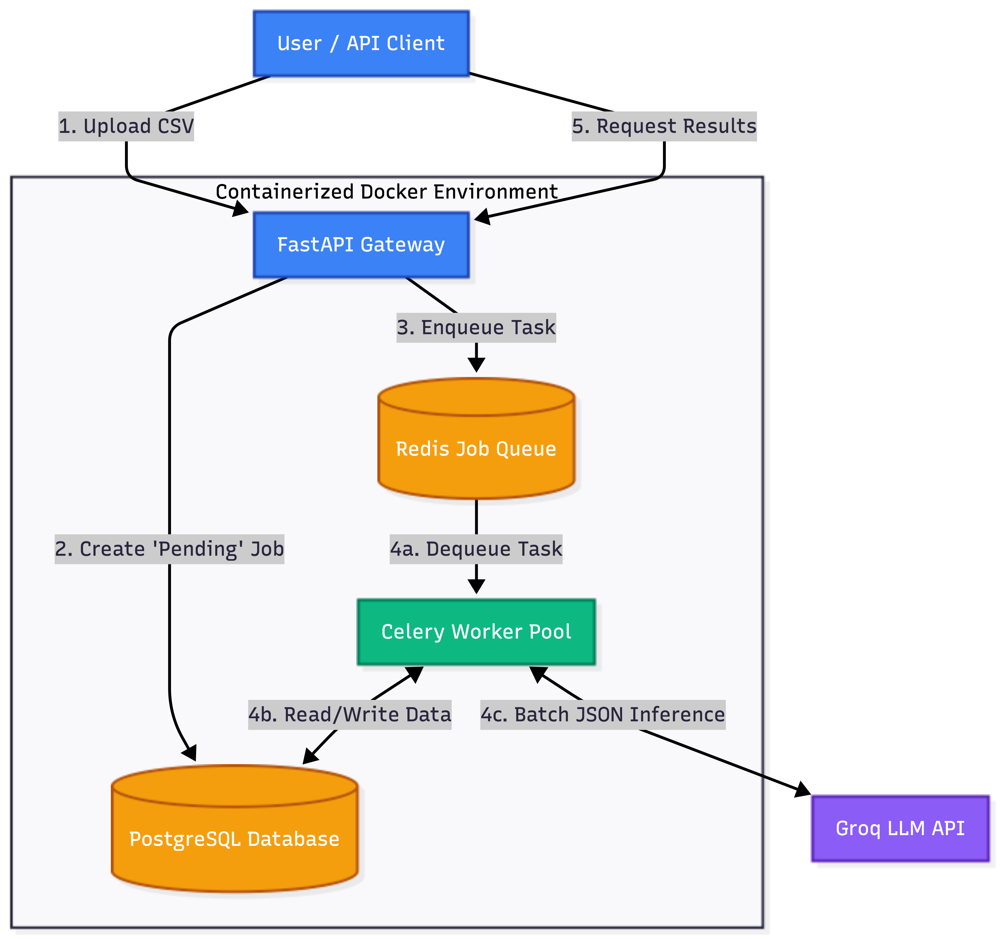
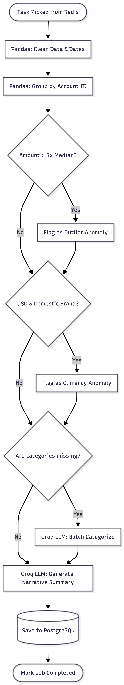

# AI-Powered Transaction Processing Pipeline

An asynchronous, event-driven backend architecture designed to ingest, clean, mathematically analyze, and LLM-classify dirty financial datasets. Built for high-throughput execution without blocking the API gateway.

**Author:** Shrav Jitendra Siddhpura

---

## 📹 Video Walkthrough

**[Watch the 3-Minute Technical Architecture Walkthrough on Loom](https://www.loom.com/share/aa0f1a19498440eda731c63c46f88aab)**

---

---

## 🏗️ 1. High-Level System Architecture

<div align="center">
  
</div>

### The "Why" Behind the Architecture

* **FastAPI Gateway:** Selected for its native Pydantic JSON serialization and high-performance asynchronous request handling.
* **Decoupled Worker Pool (Celery + Redis):** Parsing DataFrames and executing LLM network requests are computationally expensive. By pushing these to a background worker, the main API returns a tracking UUID in under 100ms, completely unblocking the client.
* **Deterministic LLM Output:** Instead of fragile prompt engineering, the Groq API is forced into strict JSON mode mapped to Pydantic schemas, ensuring zero parsing errors during database insertion.

---

## ⚙️ 2. Worker Execution Flowchart

<div align="center">
  
</div>

### Request Lifecycle & Anomaly Detection

1. **Ingestion & Delegation:** Raw CSV bytes are enqueued into Redis.
2. **Data Normalization (Pandas):** Dates are standardized to ISO 8601, and currency symbols are stripped.
3. **Statistical Anomaly Detection:** The pipeline groups transactions by `account_id` and calculates the median spend. Any transaction exceeding **3x the median** is flagged mathematically.
4. **Currency Anomaly Detection:** USD executions mapped to strictly domestic infrastructure (e.g., Swiggy, IRCTC) are instantly flagged.
5. **AI Batch Classification:** Uncategorized rows are batched into a single, structured Groq API request to fill data gaps via local inference principles.

---

## 🚀 3. Setup & Deployment (Single Command)

This entire architecture—API, Celery Worker, Redis Queue, and PostgreSQL Database—is containerized and starts with a single command.

### Prerequisites

* Docker & Docker Desktop running in the background.
* A `.env` file in the root directory containing your Groq API key:

```env
GROQ_API_KEY=your_api_key_here
```

### Start the Pipeline

**Bash**

```bash
docker compose up --build
```

---

## 📡 4. API Endpoints & Usage

### A. Upload a CSV File

Uploads the dataset and instantly returns a tracking UUID.

**Bash**

```bash
curl -X POST "http://localhost:8000/jobs/upload" \
  -H "accept: application/json" \
  -H "Content-Type: multipart/form-data" \
  -F "file=@transactions.csv"
```

**Response:**

**JSON**

```json
{
  "job_id": "a1b2c3d4-e5f6-7890",
  "status": "pending"
}
```

### B. Poll Job Status

Check if the worker has completed the batch inference.

**Bash**

```bash
curl -X GET "http://localhost:8000/jobs/<JOB_ID>/status"
```

### C. Retrieve Final Structured Results

Returns the cleaned ledger, flagged anomalies, category breakdown, and the LLM narrative summary.

**Bash**

```bash
curl -X GET "http://localhost:8000/jobs/<JOB_ID>/results"
```

---

## ⚠️ 5. Bottlenecks & 100x Scale Iteration

If application traffic scales by 100x tomorrow, this current architecture will face structural bottlenecks. Below is the blueprint for an enterprise-grade iteration.

### The Breaking Points

* **Memory Exhaustion (OOM):** Reading raw CSV files directly into FastAPI memory will crash the server upon ingestion of multi-gigabyte files.
* **Database Connection Starvation:** Concurrent bulk inserts from autoscaled Celery workers will quickly exceed PostgreSQL's default max connections, causing lockups.
* **LLM Rate-Limiting:** Massive batch requests will breach external provider TPM/RPM tiers.

### The Enterprise Re-Engineering Plan

* **De-coupled S3 Ingestion:** Deprecate `POST /upload`. Instead, the API returns a pre-signed AWS S3 URL. Clients upload directly to object storage, and an S3 Event Notification triggers the Celery worker via an SQS queue.
* **Connection Pooling:** Introduce PgBouncer in front of PostgreSQL to manage and pool thousands of concurrent worker transactions.
* **Horizontal Worker Scaling:** Deploy workers to a Kubernetes cluster using a Horizontal Pod Autoscaler (HPA) driven by the depth of the Redis message queue.
